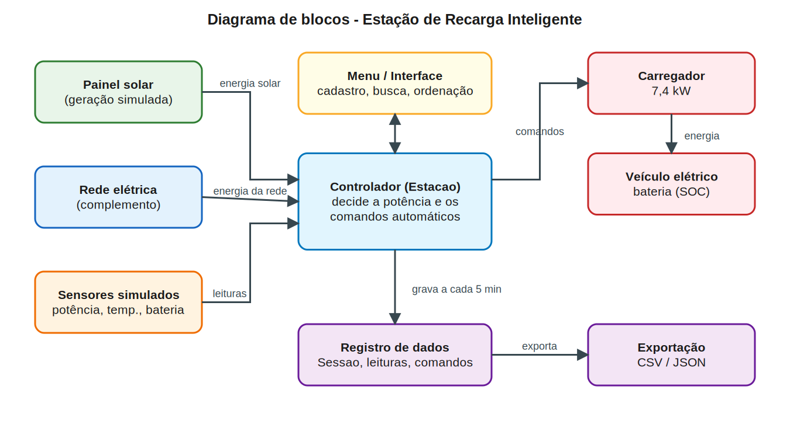
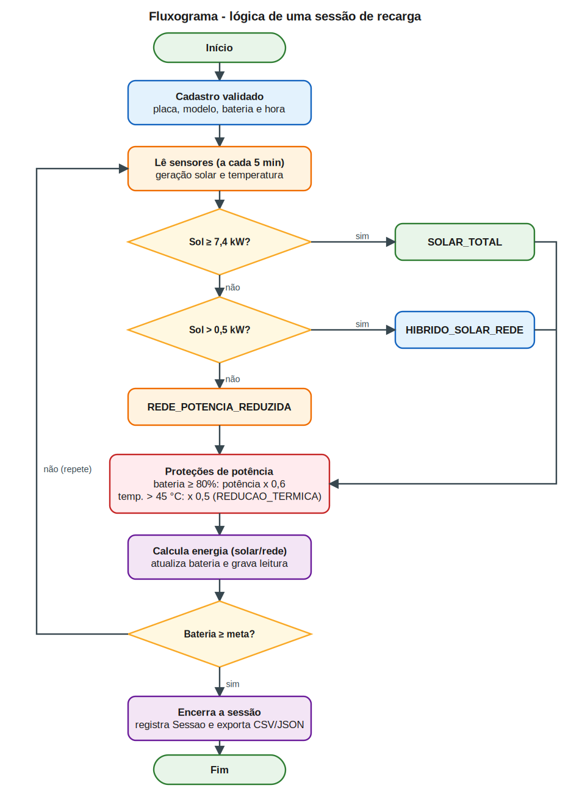

# Estação de Recarga Inteligente para Veículos Elétricos

> Sprint 3 – Prototipagem Funcional e Integração

## 1. Equipe

| Nome | RM |
|------|----|
| Guilherme Xavier | 573053 |
| Bryan Lugli | 571350 |
| Beckman Lugli | 573442 |

**Vídeo de demonstração (YouTube, não listado):** [colar o link aqui]

---

## 2. Visão geral

Nosso protótipo é uma estação de recarga de veículos elétricos **simulada em Python** que dá prioridade à energia solar. Um controlador lê a geração do painel, a temperatura e o nível da bateria a cada 5 minutos simulados e decide sozinho com que potência carregar o carro. Tudo o que acontece (sessões, leituras dos sensores e comandos automáticos) é registrado e pode ser consultado no menu ou exportado em CSV/JSON.

**Evolução entre as Sprints**
- Sprint 1: Planejar a ideia inicial
- Sprint 2: Desenvolver a ideia
- Sprint 3: Protótipo funcional integrado (esta entrega)

---

## 3. Esquema de integração dos componentes

### 3.1 Diagrama de blocos



Como os blocos conversam: o painel solar e a rede elétrica fornecem energia ao controlador, os sensores enviam leituras, e o controlador manda os comandos para o carregador, que abastece o veículo. Cada leitura e cada comando são gravados no registro de dados, que alimenta a exportação em CSV/JSON. O menu é a interface do usuário com o controlador.

### 3.2 Fluxograma da lógica de uma sessão



### 3.3 Imagens do protótipo (simulação)


> Trocar pelos prints reais da execução do `main.py`.

---

## 4. Justificativa técnica das escolhas

| Componente | Função no sistema | Por que foi escolhido |
|------------|-------------------|------------------------|
| Painel solar simulado (10 kW) | Fonte de energia renovável, com geração que segue a curva do dia e varia com nuvens | Mostra o benefício de sustentabilidade sem depender de hardware caro; a curva senoidal representa bem o sol entre 6h e 18h |
| Rede elétrica | Complementa a energia quando o sol não cobre a recarga | Garante que o carro sempre carregue, mesmo à noite |
| Controlador (classe `Estacao`) | Decide potência e comandos automáticos | Centraliza a lógica de automação em um único ponto, o que facilita testar e evoluir |
| Sensores simulados | Potência, temperatura e nível da bateria (SOC) | Permitem provar a automação: o controlador reage às leituras |
| Registro de dados (`Sessao`, leituras, comandos) | Guarda o histórico de cada recarga | Gera os dados funcionais pedidos e permite estatísticas |
| Exportação CSV/JSON | Entrega os dados em formatos abertos | Facilita análise em planilhas e integração com outros sistemas |
| Python (biblioteca padrão) | Linguagem de todo o protótipo | Roda em qualquer máquina sem instalar dependências |

**Lógica de automação (comandos):**

| Comando | Quando acontece | Efeito |
|---------|-----------------|--------|
| `SOLAR_TOTAL` | Geração solar ≥ 7,4 kW | Recarga na potência máxima só com energia solar |
| `HIBRIDO_SOLAR_REDE` | Geração solar entre 0,5 e 7,4 kW | Potência máxima; o sol contribui e a rede completa |
| `REDE_POTENCIA_REDUZIDA` | Sem sol | Recarga a 50% da potência, mais leve para a rede |
| `REDUCAO_TERMICA` | Temperatura acima de 45 °C | Reduz a potência pela metade até esfriar |

Além disso, acima de 80% de bateria a potência cai 40%, como acontece em carregadores reais.

**Contribuição para:**
- **Sustentabilidade:** prioriza energia solar e estima o CO₂ evitado (fator aproximado de 0,08 kg/kWh).
- **Automação inteligente:** o controlador ajusta a recarga sozinho conforme sol e temperatura, sem intervenção humana.
- **Eficiência energética:** reduz potência na rede quando não há sol e protege a bateria contra superaquecimento.

---

## 5. Resultados e dados funcionais

Dados gerados com `python src/main.py --demo` (semente fixa, então qualquer pessoa reproduz o mesmo resultado). Os arquivos completos estão na pasta [`dados/`](dados/).

| ID | Veículo | Bateria | Início | Duração | Energia | % Solar |
|----|---------|---------|--------|---------|---------|---------|
| 1 | BYD Dolphin | 11% → 100% | 23h | 685 min | 43,44 kWh | 30,2% |
| 2 | BYD Dolphin | 31% → 90% | 15h | 350 min | 28,79 kWh | 34,4% |
| 3 | JAC E-JS1 | 14% → 80% | 5h | 330 min | 21,67 kWh | 61,2% |
| 4 | BYD Dolphin Mini | 33% → 80% | 23h | 250 min | 15,38 kWh | 0,0% |
| 5 | Chevrolet Bolt | 13% → 90% | 5h | 515 min | 54,40 kWh | 70,8% |
| 6 | Nissan Leaf | 34% → 100% | 9h | 360 min | 28,70 kWh | 97,9% |
| 7 | BYD Dolphin | 49% → 90% | 0h | 375 min | 20,01 kWh | 0,2% |
| 8 | BYD Dolphin | 19% → 100% | 23h | 595 min | 39,53 kWh | 20,4% |

**Estatísticas do conjunto:** 8 sessões, 251,91 kWh no total, sendo 111,00 kWh (44,1%) de origem solar, média de 31,49 kWh por sessão, duração média de 432 min e cerca de 8,88 kg de CO₂ evitados.

**O que os dados mostram:** as sessões feitas durante o dia (como a 6, às 9h) usam quase só energia solar, enquanto as noturnas (4 e 7) dependem da rede e, por isso, o sistema reduz a potência. Isso evidencia o benefício previsto: deslocar recargas para o período de sol aumenta o uso de energia limpa.


> Trocar pelo print do `sessoes.csv` aberto ou da tela de estatísticas.

**Requisitos técnicos atendidos no código:** classe `Sessao`, lista de sessões, menu interativo, busca linear (placa) e binária (ID), ordenação manual (bubble, selection e insertion sort), estatísticas e validação de entradas.

| Algoritmo | Complexidade |
|-----------|--------------|
| Busca linear | O(n) |
| Busca binária | O(log n), exige lista ordenada |
| Bubble / Selection / Insertion sort | O(n²) no pior caso (insertion chega a O(n) em listas quase ordenadas) |

---

## 6. Estrutura do repositório

```
/
├── src/
│   └── main.py             # código-fonte do protótipo
├── dados/                  # sessoes.csv, sessoes.json, leituras.csv, comandos.csv
├── docs/
│   ├── diagramas/          # diagrama_blocos e fluxograma (SVG e PNG)
│   └── imagens/            # prints da execução
└── README.md
```

---

## 7. Como executar

**Requisitos:** Python 3.8 ou superior. Não precisa instalar bibliotecas.

```bash
git clone [link do repositório]
cd [pasta-do-projeto]
python src/main.py            # menu interativo
python src/main.py --demo     # gera 8 sessões de exemplo e exporta os dados
```

**Passo a passo no menu:**
1. `7` gera sessões de demonstração (ou `1` cadastra uma sessão manualmente).
2. `2` lista as sessões, `3` busca por placa ou ID, `4` ordena.
3. `5` mostra as estatísticas e `6` o log de comandos automáticos.
4. `8` exporta os dados para a pasta `dados/`.
